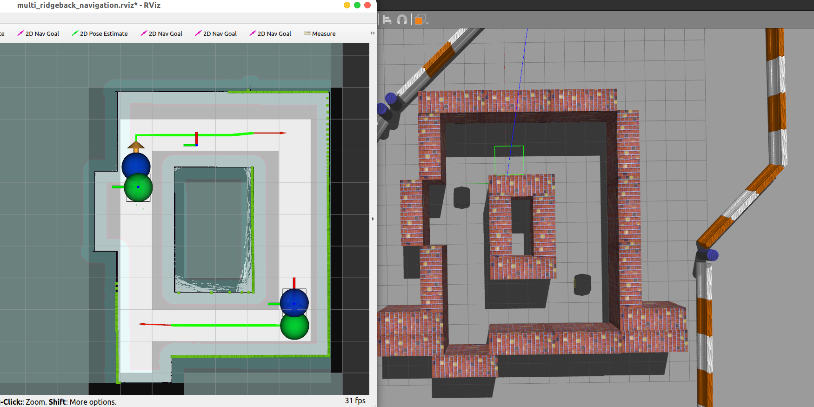
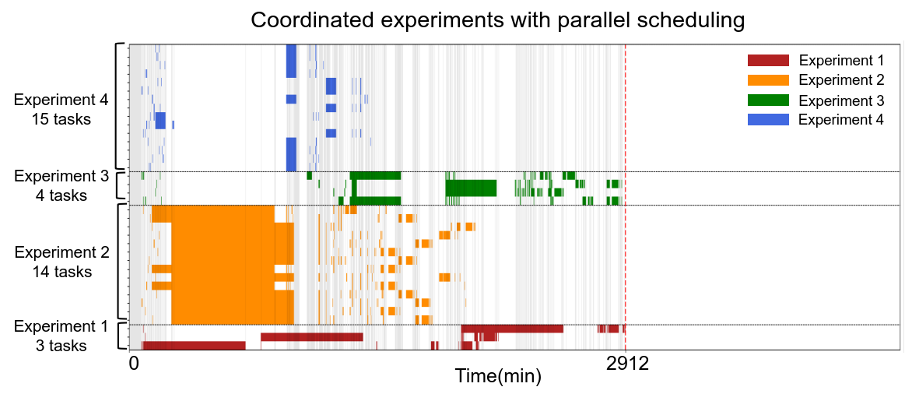

# multi-bot-coordinator

This repository integrates algorithm libraries for multi-robot-multi-task scheduling.

### multi_agent_path_finding

This is a multi-agent path planning(also known as Multi-Agent Path Finding, MAPF) algorithm package for ROS.

  

This meta-package contains two repositories: [mapf_ros](./multi_agent_path_finding/mapf_ros) and [ridgeback_mapf](./multi_agent_path_finding/ridgeback_mapf). The mapf_ros repository implements the core MAPF (Multi-Agent Path Finding) algorithm under ROS (Robot Operating System), while ridgeback_mapf is a robot simulation package used for testing the MAPF algorithm.

**For more detailed instructions, please refer to the README.md files within each package.**

### multi-robot-multi-task_scheduling

This repository contains the code for the multi-robot-multi-task scheduling module. 

  

**For more detailed instructions, please refer to the [scheduling-README.md](./multi-robot-multi-task_scheduling/README.md).**

