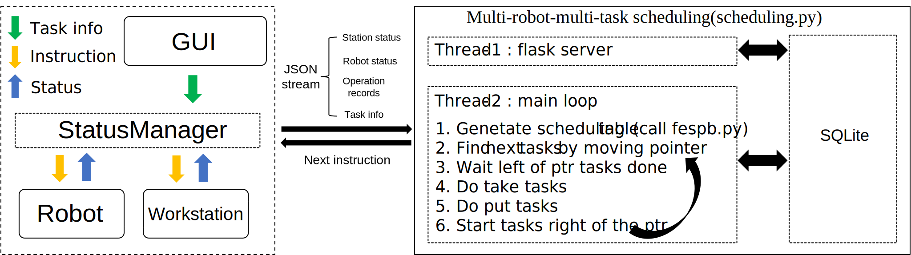
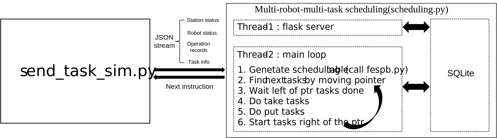
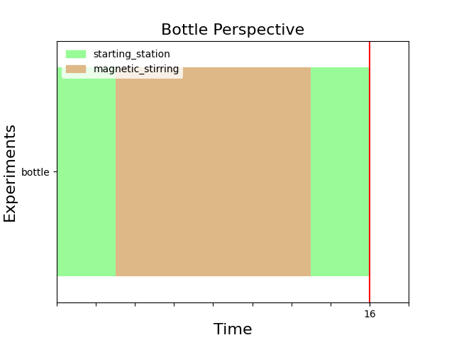
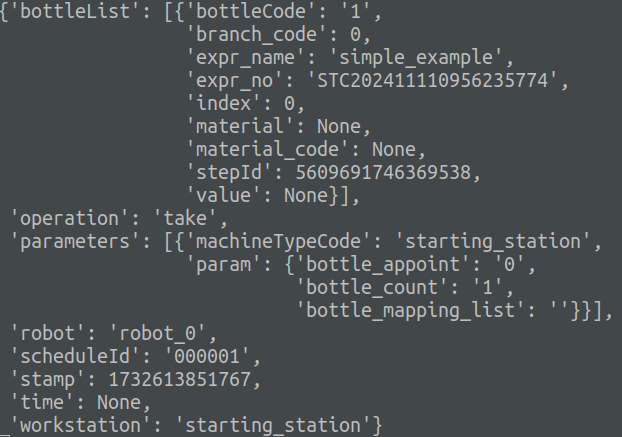

# A "hello world" example

This repository provides a task with only 3 steps, 2 workstations, and 1 robot. Due to the very short task flow, readers can carefully study the input and output of the scheduling algorithm by combining code comments, communication logic diagrams, and printed logs.

## Directory tree
> + data
>   + simple_expamle.json(A simple example with the minimum number of workstations and the shortest task length.)
>   + simple_example_annotation.json(The file with annotations for the keywords in simple_expamle.json.)
>   + simple_expamle.sqlite(The information about robots, workstations, and tasks in simple_expamle.json, as well as the scheduling plan table generated by FESP-B for optimizing the task sequence in simple_expamle.json.)
> + fespb
>   + fespb.py(The core function of the FESP-B algorithm uses a constraint programming solver to plan task constraints. It takes a task sequence as input and outputs a task scheduling table.)
> + utils
>   + db_tools.py(Utility functions for updating and querying related parameters from the database.)
> + draw_schedule.py(Draw a task schedule table saved in SQLite into an image.)
> + scheduling.py(Multi-robot-multi-task scheduling code, calling fespb.py to generate a task schedule, then traversing the schedule to assign robots and workstations to execute task steps.)
> + send_task_sim.py(Simulate HTTP communication.)
> + README.md


## Communication logic of scheduling

In the laboratory, the real logical framework is illustrated as follows:




In the laboratory, a "StatusManager" packages robot status, workstation status, task sequence, and operation records into a JSON character stream, which is then sent to the multi-robot-multi-task scheduling module (```scheduling.py```). The multi-robot-multi-task scheduling module generates a task scheduling table based on the received information, stores it in SQLite, and sends the next set of instructions to the workstations and robots.

In this example, we simulate the aforementioned "StatusManager" by directly sending the packaged JSON (```simple_expamle.json```) character stream to the multi-robot-multi-task scheduling module (```scheduling.py```) via ```send_task_sim.py```. This generates a task scheduling table (```simple_expamle.sqlite```), and the next set of instructions to be executed can be seen in the terminal's LOG.



## Quickstart

1.Start the simulated JSON transmission script.
```python
cd multi-bot-coordinator/multi-robot-multi-task_scheduling/hello_world_example
python3 send_task_sim.py
```

2.Start the multi-robot-multi-task scheduling script.
```python
cd multi-bot-coordinator/multi-robot-multi-task_scheduling/hello_world_example
python3 scheduling.py --debug
```

3.Run the plotting function to view the task scheduling table.
```python
cd multi-bot-coordinator/multi-robot-multi-task_scheduling/hello_world_example
python3 draw_schedule.py
```


4.Check the terminal output of running scheduling.py, and compare it with the diagram. The next operation is to assign a robot to the starting_station to pick up the bottle.



## Study the code
The core code is fully annotated, and readers can also use printed logs to assist in studying the code.