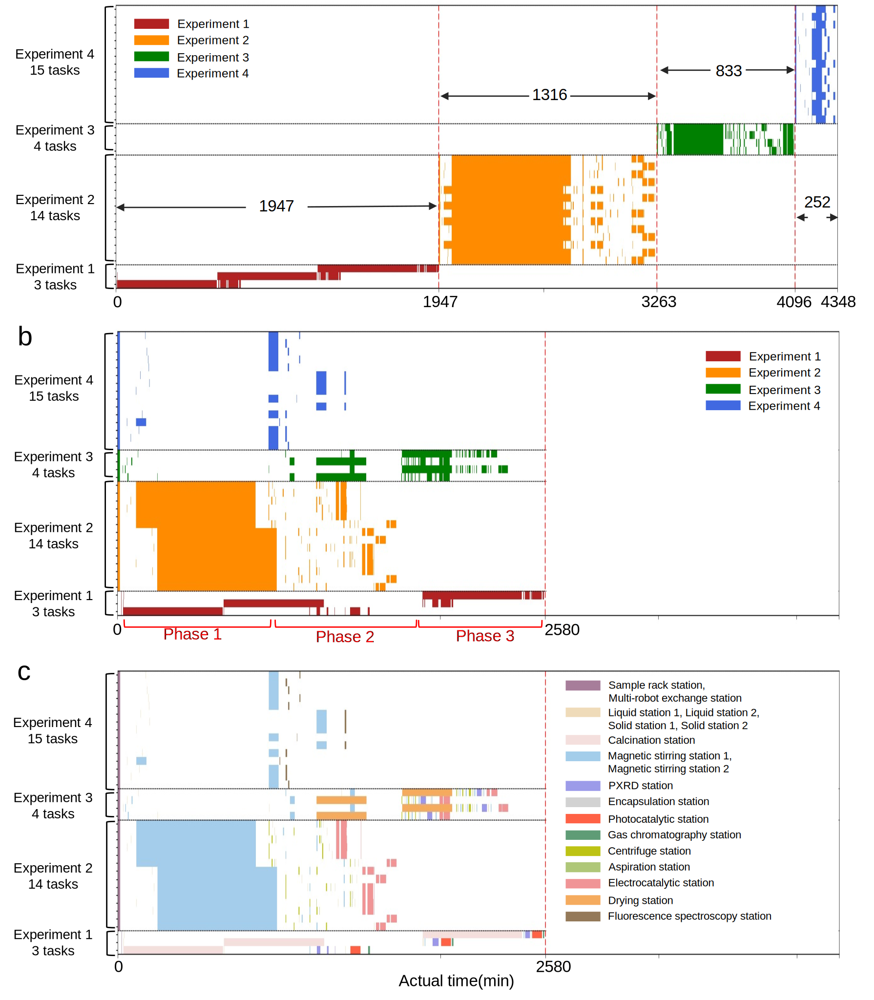
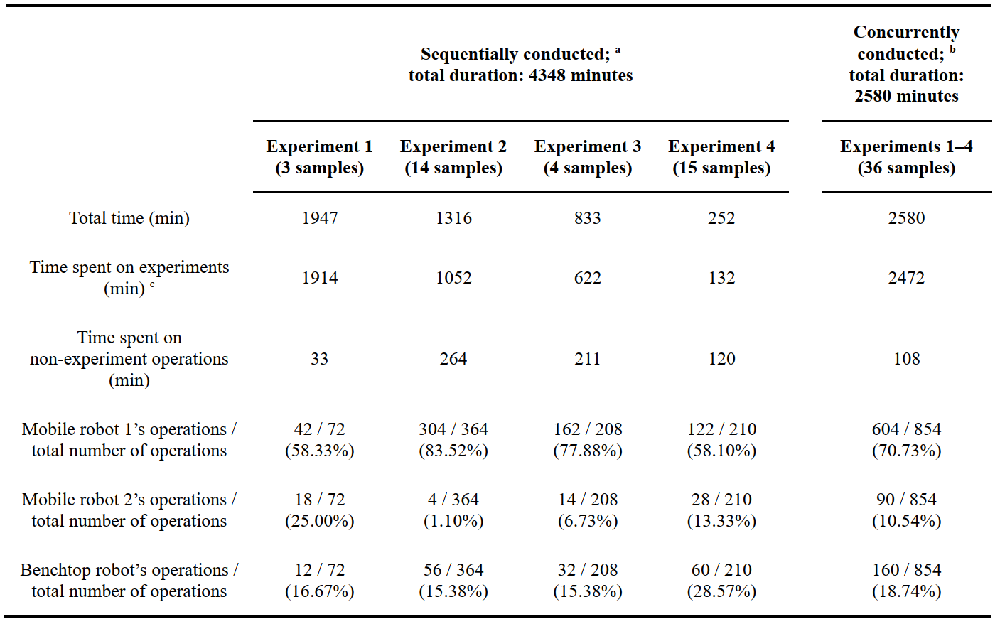

## Real experiments

This folder provides the scheduling data from the 4 real experiments and the code for rendering the scheduling results. 

The **data** folder contains the real experimental scheduling data. By running draw_schedule_comp_real.py, the readers can generate Figure 8. 

```python
cd multi-bot-coordinator/multi-robot-multi-task_scheduling/real_experiments_data
python3 draw_schedule_comp_real.py
```




By running draw_schedule_real.py and adjusting the data parameters, the readers can generate Table 1.


