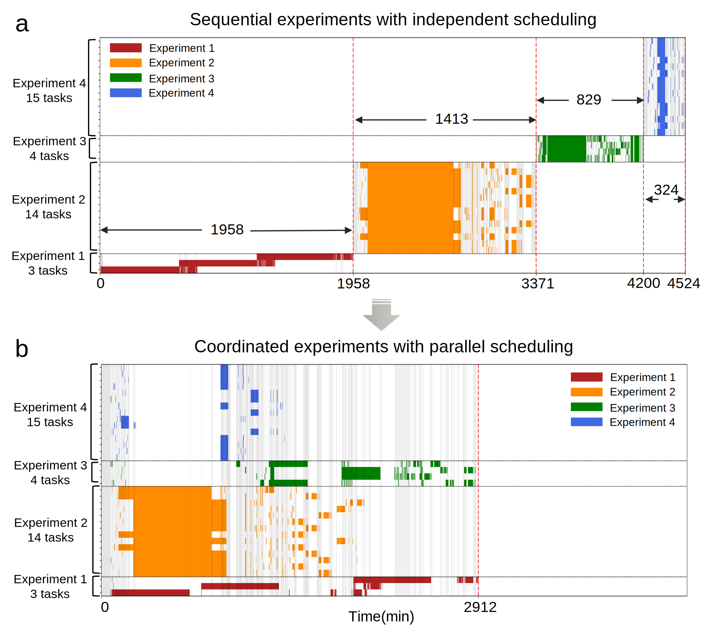
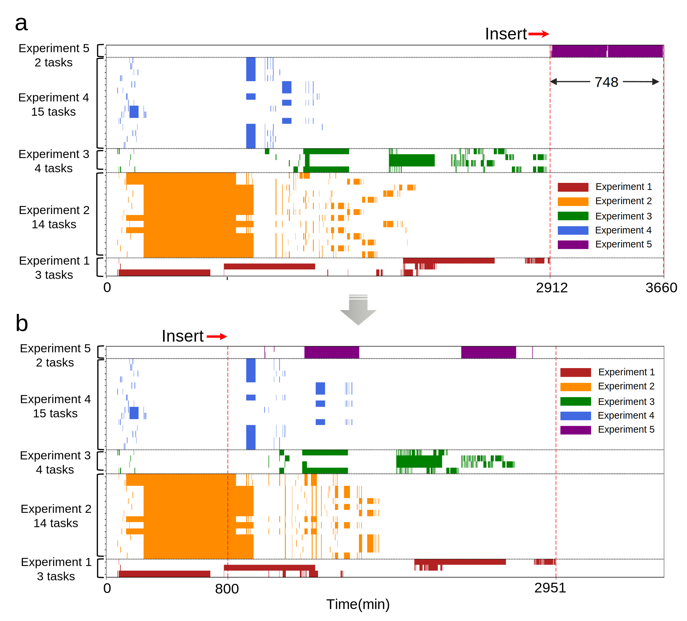
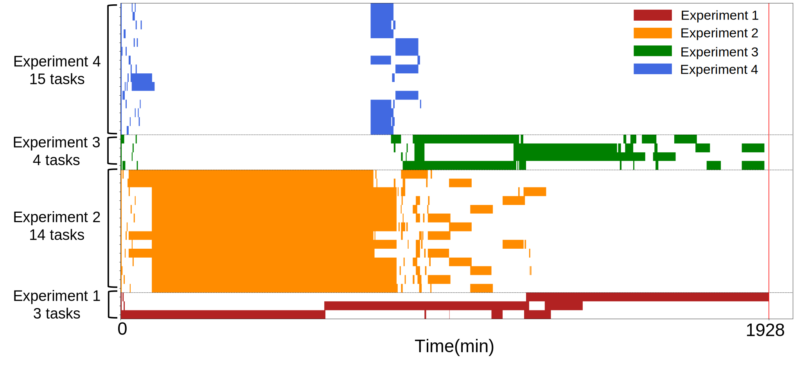

## Simulation

This folder's code offers two usage methods. 

The first method allows the reader to directly render the pre-generated simulated task scheduling table (with a .sqlite extension) to generate the simulation data presented in the paper. 

The second method involves using the FESP-B algorithm to generate a task scheduling table (with a .sqlite extension) from the initial task sequence (with a .json extension), after which the first method can be repeated to obtain the simulation scheduling results.

The JSON file records global state data, including task sequence information, robot status, workstation status, and historical command records. The SQLite file is a database format file that stores task sequence information, robot status, workstation status, and historical command records from the JSON file in a database format, almost encompassing all the information in the JSON file. Additionally, during the experiment, the SQLite file also saves the task scheduling table calculated by the FESP-B algorithm, which is used to indicate the logic progress of tasks.

The JSON data uses UTF-8 encoding, and the text data in SQLite is also encoded using UTF-8.

### 1. Directly render the results of the paper.

#### (1) Multi-robot-multi-task scheduling tables for four simulation experimental tasks using 2 mobile robots(Fig. 3 in paper)

```python
cd multi-bot-coordinator/multi-robot-multi-task_scheduling/simulation_methods
python3 draw_schedule_comp_4_exprs.py --num_robot 2
```


#### (2) Simulated scenarios of using 1 to 5 robots to automate the four simulation experiments(Fig. 4 in paper)

change num_robot from 1 to 5
```python
cd multi-bot-coordinator/multi-robot-multi-task_scheduling/simulation_methods
python3 draw_schedule_comp_4_exprs.py --num_robot 1
```

#### (3) Dynamic rescheduling upon insertion of new tasks(Fig. 5 in paper)
```python
cd multi-bot-coordinator/multi-robot-multi-task_scheduling/simulation_methods
python3 draw_schedule_dynamic_insert.py
```



#### (4) Essential total duration of the four simulation experiments(Supplementary Fig. S1)
```python
cd multi-bot-coordinator/multi-robot-multi-task_scheduling/simulation_methods
python3 draw_schedule_no_transfer_time.py
```




### 2. Reproduce the results of the paper.

(1) Select an example from [examples](./examples).

(2) In [send_task_sim.py](./send_task_sim.py), modify the raw task sequence file reading path to the example selected in (1).

(3) In [scheduling.py](./scheduling.py) line 27, modify the save path of the scheduling table database.

(4) Then run the following two scripts:

Send the initial task sequence to the multi-robot-multi-task scheduling algorithm via the simulation code.
```python
cd multi-bot-coordinator/multi-robot-multi-task_scheduling/simulation_methods
python3 send_task_sim.py
```

Then, open a new terminal and run the multi-robot-multi-task scheduling algorithm.
```python
cd multi-bot-coordinator/multi-robot-multi-task_scheduling/simulation_methods
python3 scheduling.py --debug
```

(5) Save the scheduling table.(xx.sqlite)

Repeat the above 5 steps to obtain the scheduling tables for all files except 5_experiments.json. The "5_experiments.json" file is used to simulate the insertion of experiment 5.

(6) Generate the scheduling table for 5_inserting experiment 5..
- Modify the file reading path in [send_task_sim.py](./send_task_sim.py) to "4_experiments.json".
- In [scheduling.py](./scheduling.py) line 27, modify the save path of the scheduling table database to "5_experiments.sqlite".

- Run the two scripts:

  - Send the initial task sequence to the multi-robot-multi-task scheduling algorithm via the simulation code.
    ```python
    cd multi-bot-coordinator/multi-robot-multi-task_scheduling/simulation_methods
    python3 send_task_sim.py
    ```

  - Then, open a new terminal and run the multi-robot-multi-task scheduling algorithm.
    ```python
    cd multi-bot-coordinator/multi-robot-multi-task_scheduling/simulation_methods
    python3 scheduling.py --debug
    ```

- Exit the terminal running [send_task_sim.py](./send_task_sim.py) while holding the terminal running [scheduling.py](./scheduling.py) after waiting for scheduling.py to output the scheduling results.

- Modify the file reading path in [send_task_sim.py](./send_task_sim.py) to "5_experiments.json".

- Run the script:

  - Send the initial task sequence to the multi-robot-multi-task scheduling algorithm via the simulation code.
    ```python
    cd multi-bot-coordinator/multi-robot-multi-task_scheduling/simulation_methods
    python3 send_task_sim.py
    ```

- Wait for the terminal running [scheduling.py](https://github.com/pic-ai-robotic-chemistry/multi-bot-coordinator/blob/main/multi-robot-multi-task_scheduling/simulation/scheduling.py) to output the scheduling results again to obtain the dynamic insertion results(saved in "5_experiments.sqlite", corresponding to Fig. 5b).

- At this point, all simulation scheduling tables have been generated. The steps in section 1 can be repeated to obtain the simulation figures.
